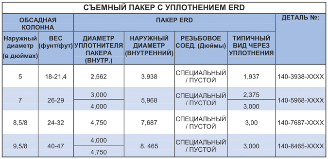

Извлекаемый пакер с гидравлическим управлением Модель PARVEEN ERD представляет собой извлекаемый пакер. Гидравлически устанавливается давление в трубе. Он используется с помощью гидравлического наладочного инструмента, а извлечение отличается высокой независимостью от НКТ с использованием инструмента для извлечения, управляемого на рабочей колонне. Этот пакер идеально подходит для сильно наклонных скважин, как на суше, так и на море.

**Приложения:**

* Извлекаемый пакер с гидравлическими моделями ERD можно использовать в нефтедобывающих скважинах, а также в водо- или газонагнетательных скважинах.

**Особенности, преимущества и выгоды:**

* Спуск и настройка с помощью НКТ
* Гидравлическая установка обеспечивает ожидание открытия, открытия и закрытия с помощью скользящих втулок для выделения жидкостей.
* Воздействие на НКТ (сжатие и воздействие) передаются на клинья - отсутствует срезное кольцо, ограничивающее эти напряжения.
* Извлечение независимо от трубки с помощью инструмента для извлечения. Его можно поднять на дно скважины с помощью перепускной заглушки в ниппеле для государственного пласта.

