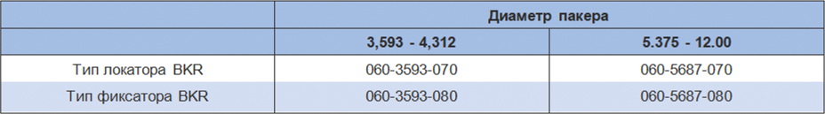

**Тип локатора:**

Этот блок требует надежного контроля золотникового клапана и герметизирует трубку в фиксаторе во время операции нагнетания, когда действие в анкеровке не оправдано. что позволяет закрыть клапан, а право остается запечатанным в отверстии фиксатора. Затем можно приложить давление к колонне насосно-компрессорных труб для проверки. Чтобы получить выгоду от открытия держателя, просто поднимите НКТ. Центрирующий узел должен быть спущен выше, чтобы достичь точного вхождения жала уплотнительного ниппеля.

**Тип фиксации:**

Этот блок обеспечивает точное управление золотниковым клапаном и герметизирует трубку в держателе во время операций нагнетания, эффективно закрепляя трубку в держателе. что позволяет закрыть клапан, а право остается запечатанным в отверстии фиксатора. Затем к колонне насосно-компрессорных труб можно приложить давление для проведения испытаний. Освобождение произошло за счет подъема вверх примерно на 8000 фунтов. который сожмет защелку и освободит блок уплотнения от фиксатора. После многократного использования защелкивания значений и извлечения уменьшается до 2500 фунтов. подвески и 5000 фунтов. усилие отрыва. Центрирующий узел должен быть установлен выше, чтобы достичь точного вхождения уплотнительного ниппеля.

