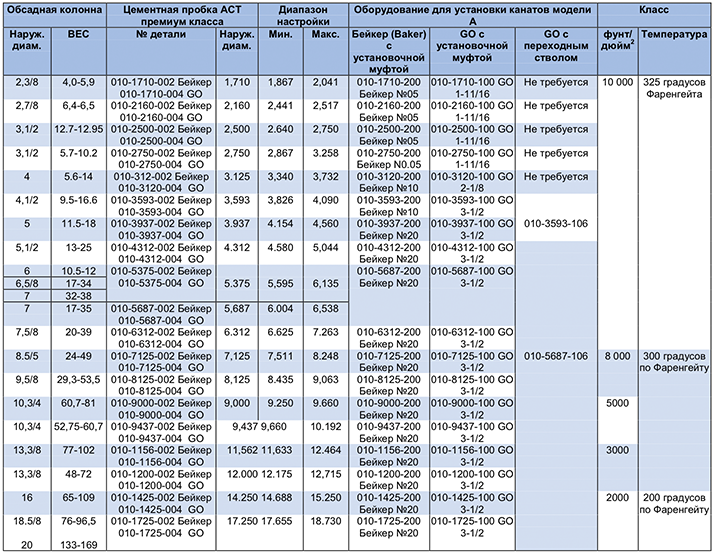

**Функции**

* Разбуриваемая чугунная конструкция
* Использует установочные втулки Alpha Big Boy и переходные стержни
* Установка троса на GO или инструмент для регулировки давления на тросе Baker
* Гидравлический комплект на гидравлическом наладочном инструменте PARVEEN
* Небольшие наружные диаметры для дополнительного зазора в обнаружении вязких жидкостей
* Комплект цельных плашек в корпусах премиум класса, в том числе П-110
* Система упаковки Multi-Durometer
* Пробка остается установленной до тех пор, пока давление газа не выровняется во время разбуривания
* Для временной или постоянной службы

Мостовая пробка PARVEEN Model A Lite представляет собой пробку среднего давления, изготовленную из разбуриваемого чугуна, в которой используются установочные втулки Alpha Big Boy и переходные стержни. Его можно установить на любом инструменте для настройки давления на кабеле типа GO или Baker или на трубе/ГНКТ с помощью гидравлического инструмента для PARVEEN. При установке противоположных плашек, расположенных над и под резиновыми уплотнениями. Одностороннее стопорное кольцо с храповым механизмом удерживает установочное усиление, устанавливаемое к противоположным клиньям и резине, для обеспечения герметичности при повышенном расширении. Цельные накладки надежно уплату за заглушку в корпусе премиум-класса, включая P-110.Плетеные клинья острые и закалены до глубины плетения, используются клиньям захватывать только стенку обсадной трубы, сохраняя при этом мягкий чугун внутри для облегчения бурения. Верхние плашки в заданном положении во время операции бурения, чтобы обеспечить выравнивание давления газа. Эта пробка идеальна для транзитной зоны, где эффективна цементация под давлением, гидроразрыв пласта или сброс пробки. Это также хорошо в горизонтальном применении, потому что нет резервных колец. Дополнительные системы набивки Viton или Aflas снижаются по специальному заказу. Инструменты Specialapplication могут быть специально разработаны для конкретных конкретных пользователей.

