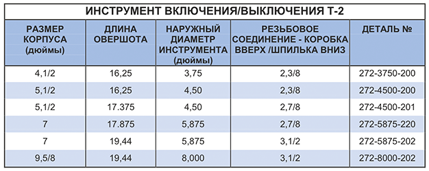

* Пакер для использования в качестве пробки-моста для общеобщественной зоны или временного отказа от использования зоны, что требует значительных затрат на буровую установку.
* Инструмент может быть испытан полным давлением на поверхности для экономии времени буровой установки.
* Инструмент можно закрепить в положении среза вверх или вниз, что соответствует настройке пакера и стилем извлечения.
* Стандартный левый или опциональный правый фиксатор на четверть оборота требует простую работу по буровой установке.
* Склеенные пломбы позволяют многократно разъединять без клеточного изъятия
* Прочная и надежная конструкция позволяет использовать НКТ, не нарушая упаковки.
* Промышленный мак прорезает обломбаш и высвобождает застрявшее в стволе скважины оборудование.

**Параметры:**

* Инструмент доступен в различных материалах
* Дополнительный правый четвертьоборотный выпуск удобный для восприятия промаха.
* Стингер доступен со всеми распространенными профилями каната.

