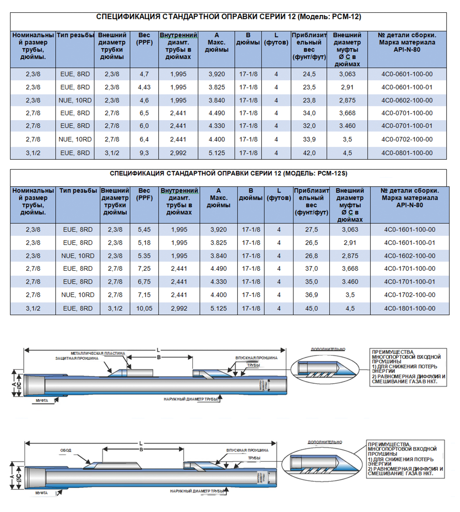

**ОБЫЧНАЯ ОПРАВКА – СЕРИЯ 12 (Модель: PCM-12)**

Оправки Серии 12 оценки для установки любого клапана сной проушиной ½” NPT, максимальным наружным диаметром 1-1/16″ и высотой 17,1/8”. Доступны трубы различных размеров, типов и марок резьбы. Ниже приведены только самые популярные сорта и размеры.

