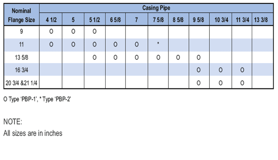

Стандартная **нижняя упаковка – выключена типа «ПБП1».**

В нижнем фланце головки обсадной колонны и головке насосно-компрессорной трубы устанавливается внешний уплотнитель для предотвращения высокого давления на нижнем фланце.

Нижняя набивка типа «PBP1» герметизирует давление в кольцевом пространстве за счет нагнетания набивки. Нижний пакет – от ПБП – 2 предназначен для образования положительного кольцевидного уплотнения с увеличенными уплотнительными кольцами под давлением.

Для работы на рабочем месте используется плата «ПП».

При сборке нижнего кожуха кожух следует обрезать на 90 мм от поверхности верхнего фланца соединительного золотника.

