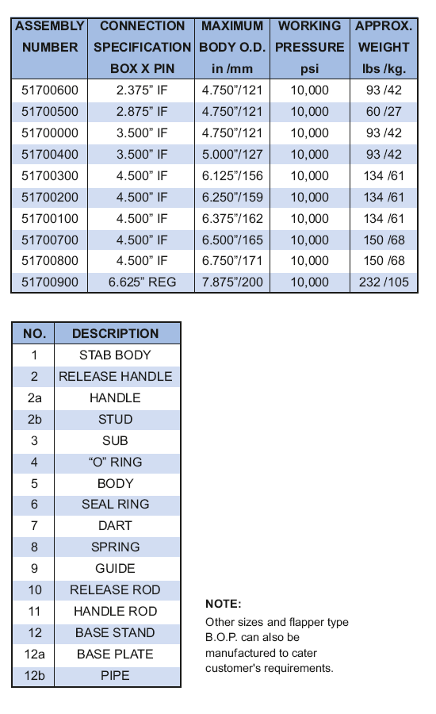

Противовыбросовой превентор обратного типа PARVEEN подходит для использования на бурильных трубах с подпружиненным клапаном и седельным механизмом для измерения давления от бурильной колонны. Во время нормальной работы он позволяет восходящему потоку циркулирующего материала через буровой насос, стояк, поворотный вертлюг и буровой шланг, но при естественном восходящем потоке, когда циркуляция прекращается. При возникновении обратного потока клапан автоматически фиксируется в своем положении, тем не менее не защищает только буровой насос, стояк, вращающийся вертлюг, буровой шланг от повреждения, но и предотвращает выброс.

**PARVEEN** BOP также имеет механизм принудительного переключения в рабочем состоянии против давления в скважинах с помощью прижимной планки или стержня разблокировки и рукоятки разблокировки – механизм разблокировки штифта/шпильки. Логика установки базовой стойки противовыбросного превентора также может быть предусмотрена стойка.

