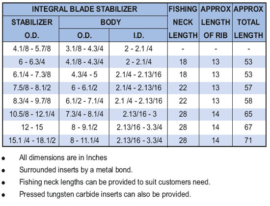

**СТАБИЛИЗАТОРЫ**

**Стабилизаторы PARVEEN** для измерения искривления скважины, предотвращения обнаружения прихвата и сведения к минимальной степени искривления и, таким образом, повышают оптимальную производительность бурового долота. Для заказа стабилизаторов **PARVEEN** рекомендуется использовать наружные диаметры ребер. Диаметр до 10 дюймов – размер отверстия на 1/32 дюйма меньше. Диаметр до 15 дюймов – размер отверстия на 1/16 дюйма. Диаметр более 15 дюймов – размер отверстия меньше на 3/32 дюйма. Большинство стабилизаторов проявляют специфический устойчивый эффект, когда потеря веса снижается от 1/8 дюйма до 3/16 дюйма. На рекламе рекомендуется стабилизатор к замене.

**ВСТРОЕННЫЕ СТАБИЛИЗАТОРЫ НОЖЕЙ PARVEEN**

**Стабилизаторы лопастей PARVEEN** Integral разработаны со спиральными спиральными ребрами с твердым покрытием и средними как в виде струн, так и рядом с долотом. Стабилизаторы в стандартном использовании правосторонние спирали. Может быть обеспечена равномерная настройка для левосторонних спиралей. В то время как в спиралях три ребра подвержены воздействию контакта со стенкой под углом 132° и 95° (при прямолинейном сверлении), в узких спиралях три ребра подвержены воздействию контакта со стенкой 360 градусов и 260 градусов, что достигается центрирование бурильной колонны в наклонных скважинах.

