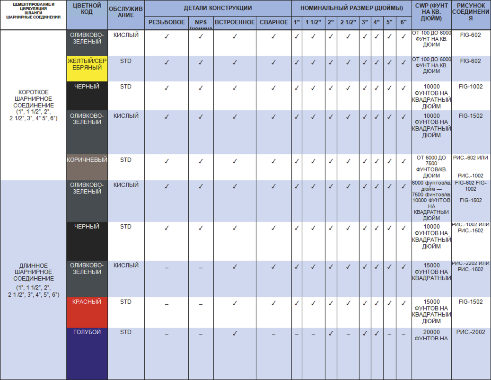

**Общее описание**

**Введение**

Цементировочные и циркуляционные шланги PARVEEN производятся в различных размерах (от 1″ до 4″) и в различных конфигурациях, чтобы практически все потребности нефтяной промышленности. Они могут работать со спектром жидкости при холодном рабочем измерении до 20 000 фунтов на квадратный дюйм. Эти шланги изготовлены в соответствии со стандартами ASTM/AISI, прочны, легко и быстро складываются для транспортировки. Они используют использование термообработки для получения желаемой твердости, подходящей для различных применений. Даже размеры свыше 4″ могут поставляться для безопасных людей.

**Сервисные приложения**

Эти шланги рекомендуются для использования в линиях высокого давления, линиях высокого и сверхвысокого давления, линиях нагнетания, линиях водоснабжения, линиях испытаний скважин, линиях цементирования и циркуляции, линиях временного потока и абразивных установках повышенного давления.

**Шарнирные соединения**

Шланги PARVEEN снабжены шарнирными соединениями PARVEEN, которые обеспечивают гибкость, максимизируют характеристики потока и поглощают ударные вибрации.

**Крылатые союзы**

Крыльчатые соединения PARVEEN, предусмотренные в цементировочных рукавах, обеспечивают герметичность и быстрое свинчивание и быстрое развинчивание без резьбы, сварки или специальных соединений.

**Служба кислого газа**

Цементировочные шланги PARVEEN соответствуют различным размерам и размерам для работы с высокосернистым газом в соответствии со стандартами NACE MR-01-75 и стандартом API RP-14E до рабочего давления в холодном состоянии 15000 фунтов на квадратный дюйм.

**Метод строительства**

Эти рукава могут быть изготовлены как в резьбовом, так и в цельном или сварном исполнении или с концевыми соединениями NPS.

**Стандартные шланги для ловли**

Доступны возможные стандартные поиски. Эти варианты использования полностью выдвинуты.

Резьбовой шланг – 12 футов

Шланг NPS – 12 футов

Сварной шланг – 12 футов

входящий шланг – 12 футов

Другие варианты также могут быть предоставлены по запросу. Шланги PARVEEN также уменьшаются в положении половинной секции. В этом случае указанная длина будет составлять значительную долю риска полноразмерной секции. Цикл можно разделить на различные секции в зависимости от количества союзов в цикле. Петля обычно состоит из 4 и 2 секций.

**Типы шарнирных соединений**

Шарнирные соединения PARVEEN'S могут быть изготовлены эквивалентно стилям 10, 20, 30, 40, 50, 60, 70 и 80. Обычно наиболее часто применяются различные стили в приложениях - стиль 50 и стиль 10, но PARVEEN'S может выбирать любой стиль, чтобы выбрать клиента. требования.

**Номинальное давление**

Доступные шланги соответствуют описанию, как указано в таблице ниже.

**Взаимозаменяемость**

Молотковые соединения или торцевые соединения PARVEEN взаимозаменяемы с соединениями и соединениями всех основных производителей этой продукции в мире.

