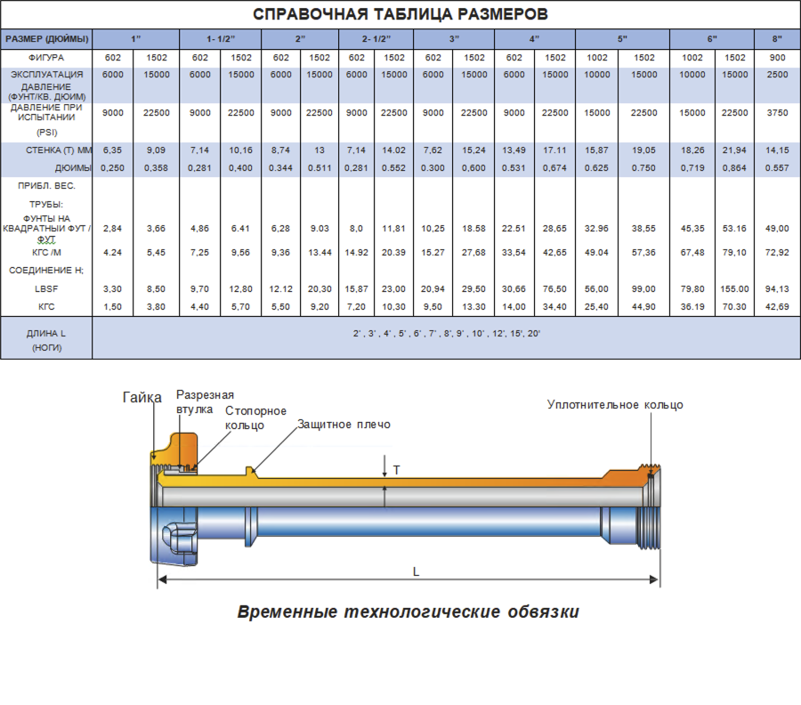

**Лечение утюгов**

Цельный обрабатывающий утюг PARVEEN состоит из встроенного торцевого соединения PARVEEN'S, которое обеспечивает универсальность сварных швов и резьбу. Доступны в представлении до 12 футов. Материал из углеродистой стали, легированной стали и легкого веса. Этот встроенный утюг для обработки работает с легкими жидкостями при холодном рабочем расходе 15000 фунтов на квадратный дюйм. Утюги для обработки PARVEEN также могут быть использованы для работы в кислых средах с CWP до 10 000 фунтов на квадратный дюйм и, при необходимости, другой поиск.

**Рекомендуемая услуга**

Они составляют резервы для повышения давления, временных потоков потоков, повышенных доходов потоков, уровней капиталовложений, расходов на водоснабжение, уровней дросселирования и глушения и абразивных приложений.

**Существенные преимущества**

Благодаря отсутствию сварных швов и резьбы, обрабатывающих утюги PARVEEN возникают однородные отверстия с большей пропускной способностью и улучшенными ожидаемыми потоками. Конструкция PARVEEN включает равномерную термообработку всего соединения для улучшения структуры структуры. Гайка может быть отсоединена для последовательной разборки в случае необходимости замены. Для этого достаточно снять стопорное кольцо.

**Конечные соединения**

Торцевые соединения предусмотрены для рис. 602, рис. 1002 и рис. 1502 или любой другой рис., требуемого заказчиком.

ПРИМЕЧАНИЕ: PARVEEN также может выбирать сварное и резьбовое обрабатывающее железо, если это требуется заказчику.

