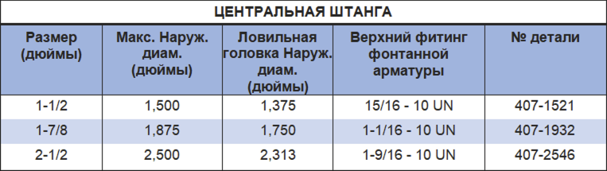

Центральное копье PARVEEN используется для захвата оборванного каната в скважине, когда он находится в свернутом состоянии. Применяется в детстве, когда оборванный трос скручен в стволе сильно скважины и не может быть захвачен тросовым захватом.

