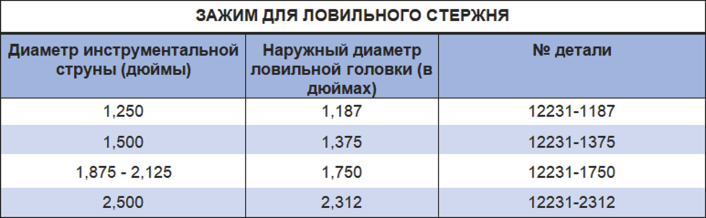

Зажим PARVEEN Toolstring Clamp встречается вокруг стандартных рыболовных шеек. Опорные рычаги опираются на коробчатую секцию крана или стоянку на кабеле, чтобы иметь возможность свинчивания регулируемой связки инструментов.

