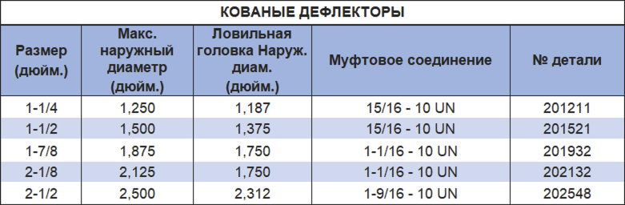

Кованое шарнирное соединение PARVEEN, собранное в колонне канатных инструментов, прочное гибкое соединение, допускающее угловое смещение колонны в искривленном отверстии. Кованое шарнирное соединение состоит всего из двух частей – штифтовой секции и коробчатой ​​секции. Гнездо штифтовой секции формируется вокруг шара коробчатой ​​секции, образуя единое целое. При наличии в шарнирном соединении можно просверлить продольное отверстие для пропуска проводников. К индивидуальному поворотному шарниру прилагается нагрузка в 40 000 фунтов, чтобы обнаружить соединение шарового шарнира с многочисленным набором.

