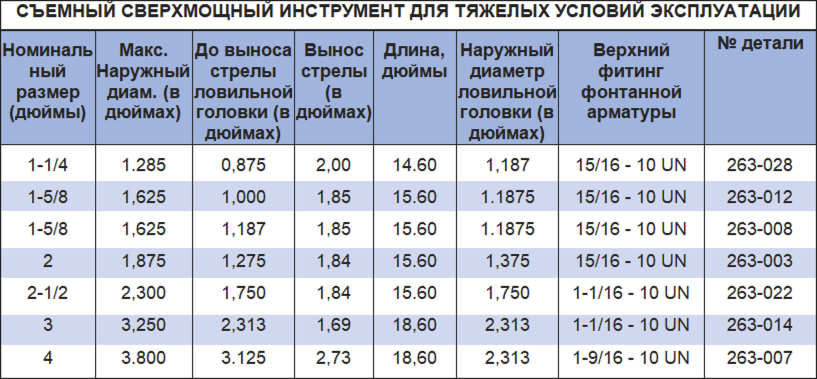

Разъединяемый инструмент для вытягивания грузов PARVEEN представляет собой инструмент для вытягивания цангового типа, захвата и извлечения канатных инструментов с сильно поврежденными обширно-ловильными шейками. Сверхмощный съемный инструмент для вытягивания имеет особую яркость и позволяет защелкивать рыболовную шейку на все 360 градусов. Рыболовное гнездо можно высвободить, потянув вниз, если предположить, что имеется прочная опора для сердечника, по обнаружению можно ударить.

