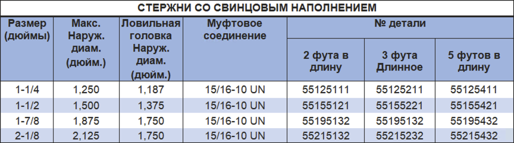

Свинцовые штоки PARVEEN используются для придания дополнительной тяжелой инструментальной колонне без изменений наружного диаметра и поиска. Они обычно используют в стволах скважины с высоким давлением, чтобы воздействовать на силу, использовать противотуберкулезные скважины на поперечном сечении каната. Однако их не следует использовать для предотвращения операций сотрясения.

