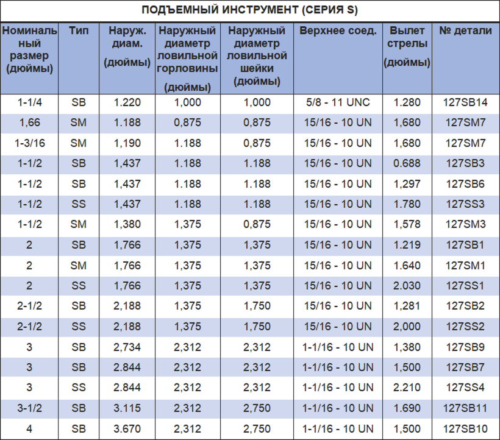

Инструмент для вытягивания PARVEEN серии «S» используется для зацепления и извлечения оборудования с внешней ловильной горловиной путем сотрясения вверх. Инструмент, предназначенный для вырезания и возврата пути сотрясения вниз. Благодаря этой функции инструмент также можно использовать в качестве спускового инструмента. Они возникают с последующим появлением типов сердечников.

1. SB: длинный сердечник, короткий радиус действия
2. SS : Среднее воздействие, средний охват
3. С.М.: Предназначен для использования в газлифтных операциях.

