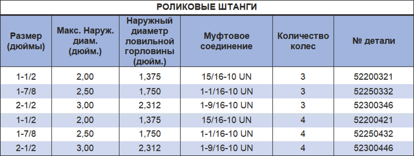

Роликовые штанги PARVEEN используются с бурильной колонной в наклонно-направленных скважинах. Они используют для минимизации, применения скольжения инструментальной колонны на стенке НКТ. Роликовые стержни используются как обычные тросовые стержни с прорезями, отфрезерованными для размещения обычных роликовых колес.

