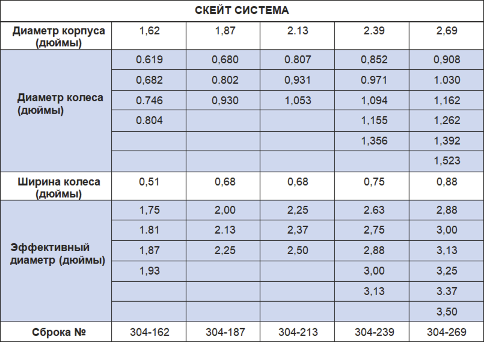

Скейт-система PARVEEN транспортирует инструментальную колонну в наклонные скважины. Преимущества включают непрерывный контактный круг со стенкой трубы в изменении положения и снижении.

**Функции:**

*  Ориентация роликов на 360 градусов требует поворота в шарнирных соединениях.
*  Зазор между колесами и полостью для исключения мусора.
*  Профилированные колеса для более легкого перемещения обломков стенок труб.
*  Отсутствие винтовых, уплотненных стопоров или штифтов колесной оси для простоты обслуживания.
*  Минимальное применение: два конька на инструментальную струну, в зависимости от применения.

