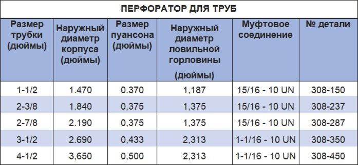

Перфоратор для труб PARVEEN представляет собой механическое устройство, предназначенное для перфорации стандартных и толстостенных труб под давлением. При развертывании в скважине встречаются способы перфорации, не требующие взрывчатых явлений, поэтому возникает способность перфорации обсадной колонны.

**К преимуществам конструкции относятся:**

*  Увеличенное проникновение НКТ
*  Положительный признак перфорации при удалении инструмента
*  Механизм безопасного выпуска, используемый инструментом из скважины без перфорации.
*  Перфоратор предназначен для изъятия перфоратора и автоматического выпуска после перфорации.
*  Использует сотрясающие удары снизу вверх для перфорации. Пробойник перфоратора используется в акустической муфте НКТ или стопором скользящего типа, который определяет точку крепления для активационного инструмента.

