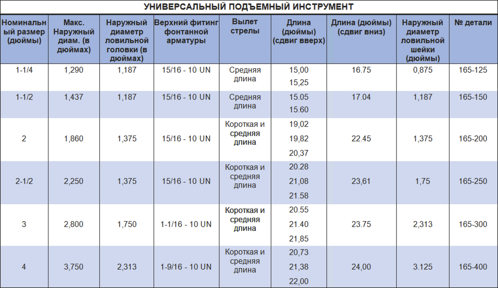

Универсальный инструмент для вытягивания PARVEEN является обычным инструментом для вытягивания со сдвигом вверх и вниз. Он используется для захвата и захвата оборудования федеральными рыболовными шейками. Он имеет универсальный стержень, который позволяет одному и тому же инструменту использовать устройство с рыболовными шейками разной опасности или вылета (т. е. со значительным, значительным и большим вылетом).

**Преимущества:**

*  Инструмент может быть преобразован из режима «сдвига вверх» в режим «среза вниз» без необходимости использования каких-либо дополнительных деталей.
*  Он выполняет ту же работу, что и два разных типа съемников, т. е. серии «JD» или «JU», серии «R» или «S». (См. стр. 66-68)
*  Универсальный стержень можно закрепить в коротком, среднем или длинном положении без необходимости приобретения повышенной стержней.
*  Срезной штифт можно заменить без разборки съемника.

