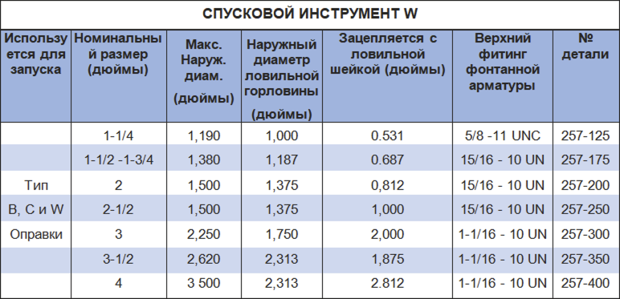

Спусковой инструмент PARVEEN "W" устанавливается в НКТ шлицевые оправки типов B, C и W. Спусковой инструмент W состоит из верхнего переводаника в комплекте с ловильной шейкой и соединением штифта насосной штанги, среднего переводчика, заднего переводчика, набора цанг и внутреннего сердечника. Когда требуется глубина достижения установки, инструменты берутся для установки плашек и приобретения резинового элемента. После установки штифта в инструменте для конкретного случая можно отрезать, а зубец можно извлечь из-за цангового патрона, что позволяет использовать инструмент для выбора из оправки.

