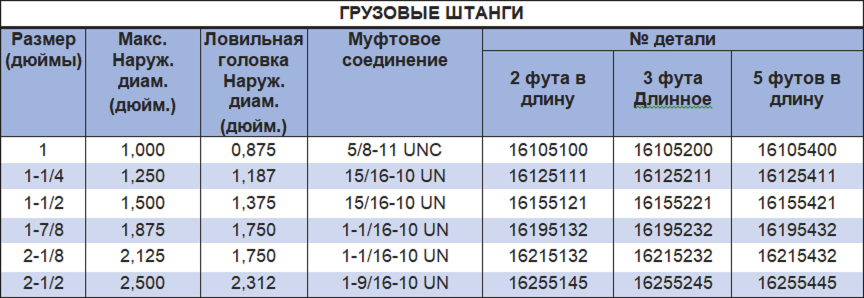

Стержни каната PARVEEN или утяжеляющая штанга, или иногда грузилом называют, вес, необходимый для достижения удара при работе с канатом и для преодоления силы, необходимой нагрузки скважины на поперечное сечение каната.

